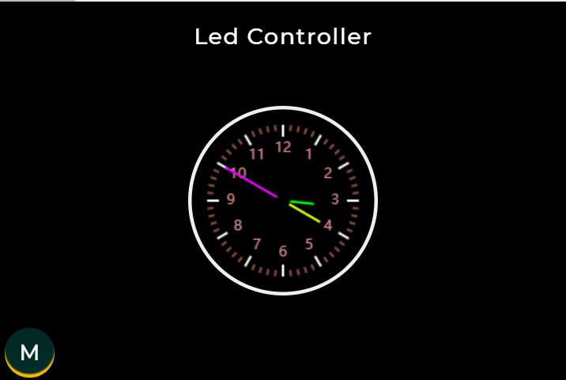
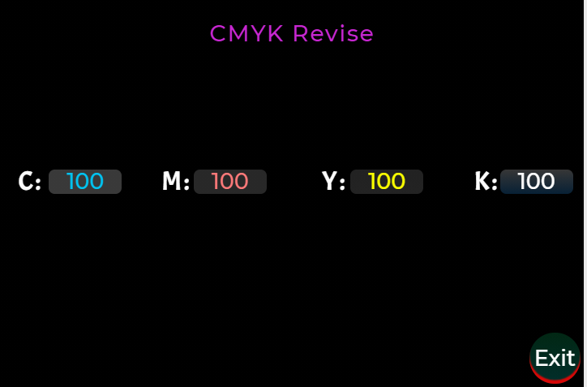

# Led Controller: 64bit ws281x的无损cymk颜色转rgb彩灯控制器

  
- [Led_Controller](#Led_Controller)
  - [更新说明](#更新说明)
  - [简介](#简介)
  - [功能](#功能)
  - [使用方式](#使用方式)
  - [关键点](#关键点)
  - [测试项目](#测试项目)
  - [测试说明](#测试说明)
  - [函数说明](#函数说明)
  - [存在问题](#存在问题)

## 更新说明

| Date       | Author | Note          | Version number |
| ---------- | ------ | ------------- | -------------- |
| 2022.06.26 | LHC    | First edition | V1.0.0         |

## 简介

- Led控制器主要由 主板卡MCU: **STM32F411CExx** 和 **3.2寸三星屏幕_TK032J25** 构成。
- 硬件板卡基本配置情况：
  -外围器件包括：``64bit ws281x灯珠`` 、``3个Ec11编码器灯板``、``USB``等基础配件。
  - 特别说明：
    > ``ws281x灯珠`` 当前为64个，数量仍可继续扩展。

## 功能

- 通过设置目标**CMYK**值，在指定的时间内进行输出。

## 使用方式

- **M**：表示``menu``菜单，**Exit**：表示退出当前界面，**R**:表示``ready``就绪，**S**：表示``start``开始，**Sw**：表示``switch``开关。
- 在主界面，1号编码器``短按``压**M**进入主菜单界面，2号编码器``左右``旋转进行子菜单选择，``短按``进入子菜单。
- 子菜单**CMYK Revise**下：1号编码器``左右``旋转对CMYK进行选择，2号编码器``左右``旋转设置目标对象值。
- 子菜单**Timer**下：1号编码器``左右``旋转``+/- 10S``，2号编码器``左右``旋转``+/- 1S``，3号编码器``左右``旋转``+/- 0.1S``;1号编码器短按，进入准备状态，再次按压灯板按照指定设置的颜色输出指定时长。3号编码器任何时候``短按``退出。
- 子菜单**Screen_Brightness**下：1编码器``左右``旋转，改变屏幕亮度。
- 子菜单**Buzzer**下：1号编码器``短按``切换蜂鸣器开关。

## 关键点

- 硬件部分：
  - 编码器质量较差，三个编码器间互相干扰较强。
  - 1号编码器和3号编码器最为稳定，但是3号编码器和1、2号编码器极性相反（软件屏蔽），2号编码器干扰尤为严重。

- 软件部分：
  - 主界面效果
  

  - CMYK调整界面
  

	
## 测试项目

- **界面切换** 每个界面间频繁切换。
- **关键功能测试** 颜色定时按设置参数进行稳定输出。

## 测试说明

- 所有功能均测试通过。

## 函数说明

- 暂略。

## 存在问题

- **MCU芯片** 未知问题，偶尔跑飞。
- **QPI_FLASH** 暂时没有启用。
- **GUI界面** 暂时未接入汉字适配和图片渲染。
- **GUI：Calendar** 偶尔会出现卡死状态。（从其他界面频繁切换后）
